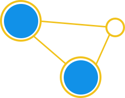

<a name="readme-top"></a>

[![Contributors][contributors-shield]][contributors-url]
[![Forks][forks-shield]][forks-url]
[![Stargazers][stars-shield]][stars-url]
[![Issues][issues-shield]][issues-url]
[![GPL-3.0 License][license-shield]][license-url]


<br />
<div align="center">
  <a href="https://github.com/critocrito/graphctl">
    
  </a>

<h3 align="center">graphctl</h3>

  <p align="center">
    Investigate complex networks.
    <br />
    <a href="https://github.com/critocrito/graphctl"><strong>Explore the docs »</strong></a>
    <br />
    <br />
    <a href="https://github.com/critocrito/graphctl/issues">Report Bug</a>
    ·
    <a href="https://github.com/critocrito/graphctl/issues">Request Feature</a>
  </p>
</div>


<details>
  <summary>Table of Contents</summary>
  <ol>
    <li>
      <a href="#about-the-project">About The Project</a>
    </li>
    <li>
      <a href="#getting-started">Getting Started</a>
      <ul>
        <li><a href="#prerequisites">Prerequisites</a></li>
        <li><a href="#installation">Installation</a></li>
      </ul>
    </li>
    <li><a href="#usage">Usage</a></li>
    <li><a href="#contributing">Contributing</a></li>
    <li><a href="#license">License</a></li>
    <li><a href="#contact">Contact</a></li>
  </ol>
</details>


## About The Project

This code was developed to help with network analyses for various investigations that took place at [Der SPIEGEL](https://www.spiegel.de) and [Paper Trail Media](https://www.papertrailmedia.de). 

<p align="right">(<a href="#readme-top">back to top</a>)</p>


## Getting Started

### Prerequisites

The project uses [Poetry](https://python-poetry.org) to manage python dependencies. To install see the [Poetry documentation](https://python-poetry.org/docs/#installation) for all options. To use the quick installer provided by Poetry run:

```sh
curl -sSL https://install.python-poetry.org | python3 -
```


### Installation

1. Clone the repo
   ```sh
   git clone https://github.com/critocrito/graphctl.git
   ```
3. Install the python dependencies
   ```sh
   poetry install
   ```
4. Make sure the command runs
   ```sh
   poetry run graphctl --help
   ```

<p align="right">(<a href="#readme-top">back to top</a>)</p>


## Usage

The `graphctl` command takes a CSV as input and outputs again CSV files with the results of the computations. The input CSV needs to have a `source` field and a `target` field, describing the nodes and their connections. This would be an example for a `network.csv`.

``` csv
source,target
nodeA,nodeB
nodeB,nodeC
nodeA,nodeC
nodeC,nodeD
...
```

Every command takes a `-g/--graph` option which selects either a directed or a undirected graph. It defaults to a undirected graph.

``` sh
poetry run graphctl -g directed <computation>
```

Here is a list of all possible outputs that can be generated from the above network.


### Topology

* Basic

  Compute a set of basic topological attributes to give a quick overview over the network.
  
  ```sh
  poetry run graphctl topology basic network.csv topology.csv
  ```


### Centrality

* Degree Centrality

  Degree centrality assigns an importance score based simply on the number of links held by each node. In this analysis, that means that the higher the degree centrality of a node is, the more edges are connected to the particular node and thus the more neighbor nodes (communication partners) this node has. In fact, the degree of centrality of a node is the fraction of nodes it is connected to. In other words, it is the percentage of the network that the particular node is connected to meaning having communicated with.
  
  ```sh
  poetry run graphctl centrality degree network.csv degree-centrality.csv
  ```

* Betweeneess Centrality

  Betweenness centrality measures the number of times a node lies on the shortest path between other nodes, meaning it acts as a bridge. In detail, betweenness centrality of a node  is the percentage of all the shortest paths of any two nodes (apart from ), which pass through . Specifically, this measure is associated with the user’s ability to influence others. A user with a high betweenness centrality acts as a bridge to many users that are not friends and thus has the ability to influence them by conveying information (e.g. by posting something or sharing a post) or even connect them via the user’s circle (which would reduce the user’s betweeness centrality after).
  
  ```sh
  poetry run graphctl centrality betweenness network.csv betweenness-centrality.csv
  ```
  
* Closeness Centrality

  Closeness centrality scores each node based on their ‘closeness’ to all other nodes in the network. For a node , its closeness centrality measures the average farness to all other nodes. In other words, the higher the closeness centrality of , the closer it is located to the center of the network.

  ```sh
  poetry run graphctl centrality closeness network.csv closeness-centrality.csv
  ```
  
* Eigenvector Centrality

  Eigenvector centrality is the metric to show how connected a node is to other important nodes in the network. It measures a node’s influence based on how well it is connected inside the network and how many links its connections have and so on. This measure can identify the nodes with the most influence over the whole network. A high eigenvector centrality means that the node is connected to other nodes who themselves have high eigenvector centralities. The measure is associated with the users ability to influence the whole graph and thus the users with the highest eigenvector centralities are the most important nodes in this network.

  ```sh
  poetry run graphctl centrality eigenvector network.csv eigenvector-centrality.csv
  ```
  
  
### Communities

* K-clique

  ```sh
  poetry run graphctl community k-clique network.csv k-clique-communities.csv
  ```
  
* Louvain

  ```sh
  poetry run graphctl community louvain network.csv louvain-communities.csv
  ```
  
<p align="right">(<a href="#readme-top">back to top</a>)</p>


## Contributing

Contributions are what make the open source community such an amazing place to
learn, inspire, and create. Any contributions you make are **greatly
appreciated**.

If you have a suggestion that would make this better, please fork the repo and
create a pull request. You can also simply open an issue with the tag
"enhancement". Don't forget to give the project a star! Thanks again!

1. Fork the Project
2. Create your Feature Branch (`git checkout -b feature/AmazingFeature`)
3. Commit your Changes (`git commit -m 'Add some AmazingFeature'`)
4. Push to the Branch (`git push origin feature/AmazingFeature`)
5. Open a Pull Request

<p align="right">(<a href="#readme-top">back to top</a>)</p>


## License

Distributed under the GPL-3.0 License. See `LICENSE.txt` for more information.

<p align="right">(<a href="#readme-top">back to top</a>)</p>


## Contact

Christo Buschek - [@christo_buschek](https://twitter.com/christo_buschek) - christo.buschek@proton.me

Project Link: [https://github.com/critocrito/graphctl](https://github.com/critocrito/graphctl)

<p align="right">(<a href="#readme-top">back to top</a>)</p>


[contributors-shield]: https://img.shields.io/github/contributors/critocrito/graphctl.svg?style=for-the-badge
[contributors-url]: https://github.com/critocrito/graphctl/graphs/contributors
[forks-shield]: https://img.shields.io/github/forks/critocrito/graphctl.svg?style=for-the-badge
[forks-url]: https://github.com/critocrito/graphctl/network/members
[stars-shield]: https://img.shields.io/github/stars/critocrito/graphctl.svg?style=for-the-badge
[stars-url]: https://github.com/critocrito/graphctl/stargazers
[issues-shield]: https://img.shields.io/github/issues/critocrito/graphctl.svg?style=for-the-badge
[issues-url]: https://github.com/critocrito/graphctl/issues
[license-shield]: https://img.shields.io/badge/License-GPLv3-blue.svg
[license-url]: https://github.com/critocrito/graphctl/blob/main/LICENSE.txt
[product-screenshot]: images/screenshot.png
